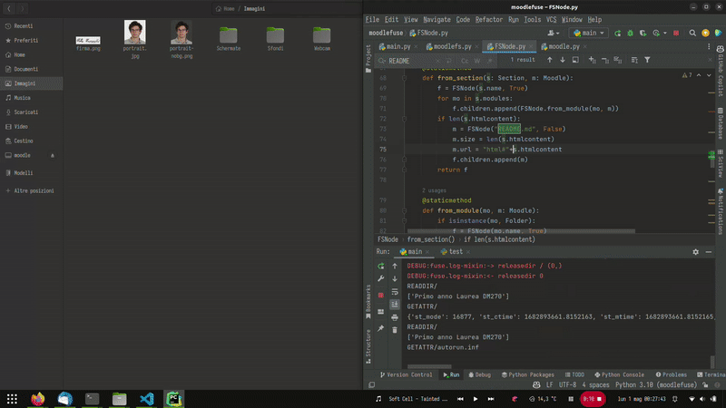

# moodlefuse - FUSE filesystem for Moodle
[](https://www.codefactor.io/repository/github/matmasit/moodlefuse/overview/main)

This is a FUSE filesystem for Moodle. It allows you to mount your Moodle site as a filesystem and access your Moodle files as if they were local files.

It is a concept that has been around for a while, but I have not found any implementations that I could get to work, or that were not abandoned.
This is my attempt at creating one.

## Installation

First, you need to create a `.env` file with the following variables:

```bash
SITE=https://moodle.example.com
MOODLE_USERNAME=yourusername
PASSWORD=yourpassword
MOUNT=/path/to/mountpoint
```

Then, just run the python script with the requirements installed. You can use a virtual environment if you want.

```bash
pip install -r requirements.txt
python moodlefuse.py
```

This only works on Linux, as it uses FUSE. I have not tested it on Mac, but it could work there too.


### Requirements

* Python 3.6 or newer
* [fusepy](https://github.com/fusepy/fusepy) - FUSE bindings for Python
* requests - HTTP library for Python
* python-dotenv - Python library for reading .env files

### Features

* Read-only filesystem to read your Moodle files and announcements
* In-memory file caching mechanism
* Automatic html-to-markdown conversion for announcements

### Future enhancements

* Better memory handling (customizable), expecially for large files (chunking)
* Forum viewing support
* Persistent tree cache (currently it is built at every mount)
* Better error handling
* Better logging
* Better documentation


### Demo


